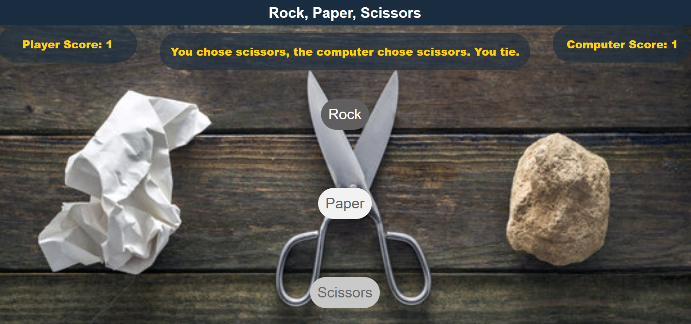
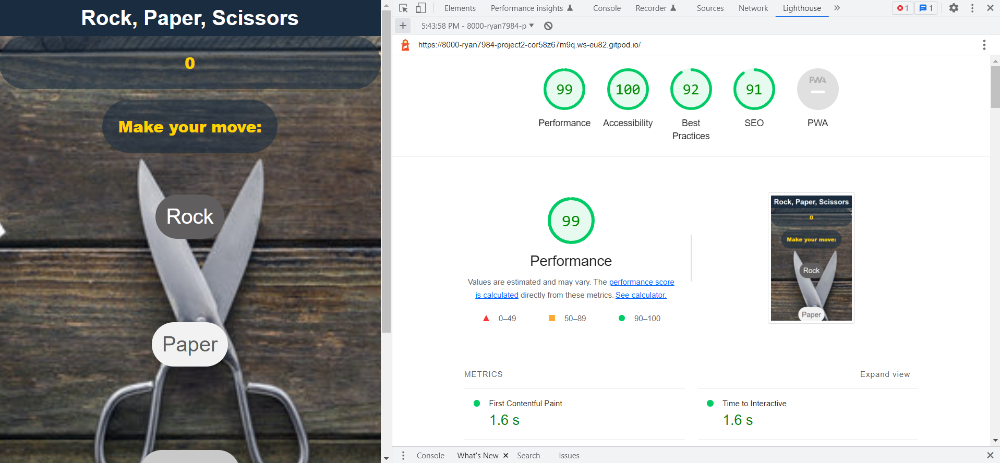
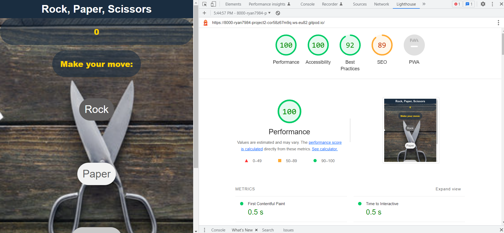
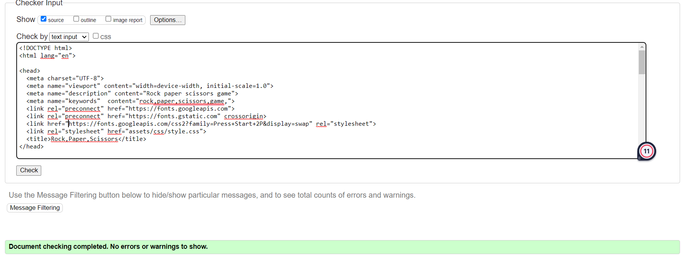
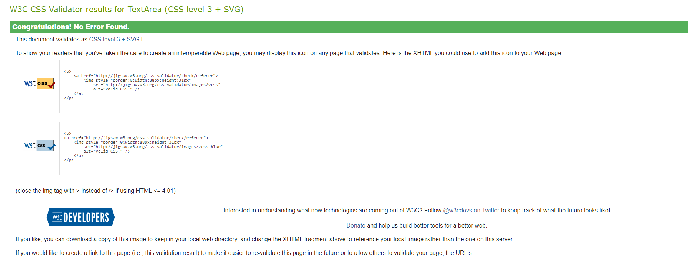
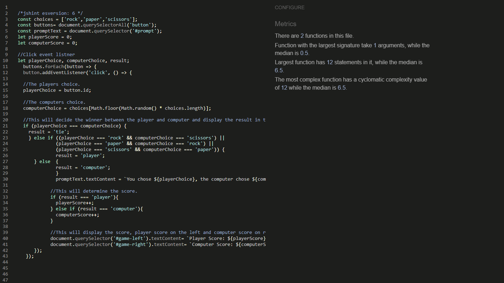

 # Project 2: Rock, Paper, Scissors game 

Rock, Paper Scissors is a one page website where the user can play against the computer at a game of rock, Paper, Scissors
The rules of the game are rock beats scissors, scissors beats paper and paper beats rock. 
the score is available for the user to see in real time.   

--------
## User Stories

Client Goals

* To make the game appealing, intuitive and accessible to all users. 
* To provide the user with a functioning rock, paper scissors game to play. 
* To be able to view the site on a range of device sizes.

First Time Visitor Goals

* To be able to view the site on a range of device sizes.
* To understand and be able to play the game immediately. 
* To easily navigate the site. 

Returning visitor Goals 

* To be able to return to the game with ease and continue playing. 

Frequent Visitor Goals 

* To create familiarity with the website. 

-----

## Design 

Colour Scheme 

* I have chosen colours that ensure that foreground information is never distracted by background.

Colors used: 

* #1A2D40 : Dark shade of cyan-blue
* #fFD200 : Light yellow shade
* #605e5e : Granite Gray
* #f2f2f2 : Gray95
* #686A6C : Nardo Gray

---
## Typography

* The google font used is: 

* Michroma, sans-serif;

---

## Imagery 

Only one image is used and it is a free stock image from Adobe. 

---

# Features

* The website consists of 1 page.

The page contains a header and footer with the main section of the website containing the game. 

 ## Future Implementations 
 
 I hope to discover new ways to enhance the website and game in the future. 

  ## Accessibility
  I have kept accessibility in mind throughout the coding process to ensure the website is as accessible and friendly as possible. I have achieved this by:

* Using descriptive alt attributes on the  image on the site 
* Using semantic HTML
* Ensuring there is sufficient colour contrast throughout the site. 

## Languages Used

* HTML, CSS and javascript were used to create this website.
* Git -For version control. 
* Github -To save and store the files for the website. 
* Am I Responsive? (website) : To check the website on a range of devices.
* Google Fonts for the font. 

---

 ## Deployment 

 I used github pages to deploy the website, I did this by carrying out the steps below:

1. I signed up and logged in  to Github.
2. I found the repository for this project, ryan7984/portfolio1 and clicked on it.
3. I then clicked on the Settings link.
4. I clicked on the pages link in the left hand side navigation bar.
5. In the Source section, I chose main from the drop down menu and then I selected root from the 
   drop down select folder menu.
6. I then clicked Save and after some time and a page 
   refresh a message   came up "Your live Github 
   Pages site is now deployed at the URL shown" and a link was then available for me to click and view my website. 

## Testing 

   Testing was ongoing throughout the whole process. I used Chrome developer tools, W3C HTML Validator, W3C CSS Validator (jigsaw) and jshint.

 ## Chrome Developer

Mobile

---

Desktop

---

## W3C HTML Validator

* Home Page HTML- No Errors found

---

---
## W3C CSS Validator (jigsaw)

* CSS  - No Errors found 
  

---
## Javascript jshint 

* CSS  - No Errors found 
  

## Unfixed Bugs 

 * Code checked on JSHint using direct input. Note that '//jshint esversion: 6' was entered at the top of the code window prior to pasting in JS code.This ensures that the feedback received from JSHint takes into account that the JS code uses ECMAScript 6 specific syntax.

 ---

 ## Credits 

 * I found slack and youtube tutorials most usefull in trying to figure out the javascript code for the game. The youtube tutorials I found most helpful are "Learn JavaScript - Full Course for Beginners" and "JavaScript Programming - Full Course" from freecodecamp.org and the youtube channel "programming with Mosh". 

--

   

